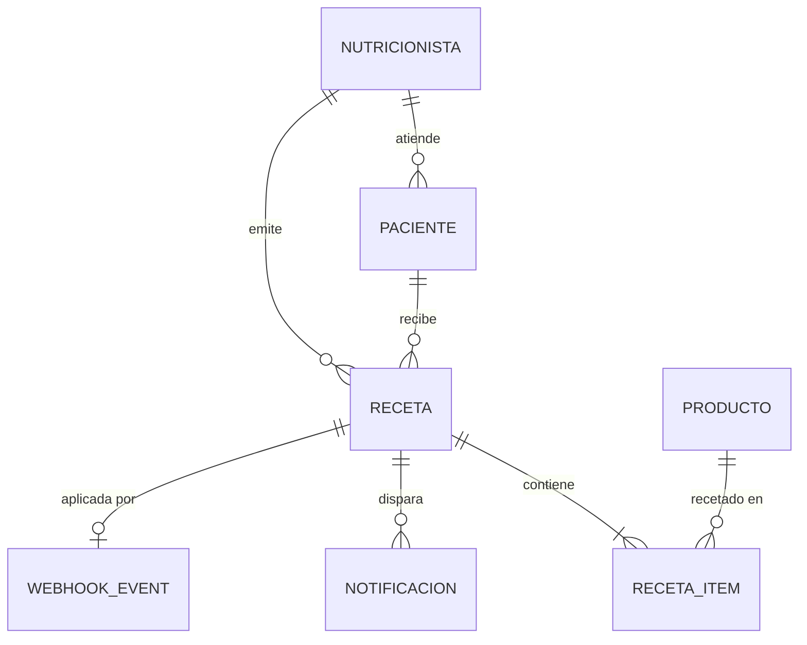

# 02 — Modelo de datos (DDL)

Convenciones (heredadas de imedba): snake_case, PK UUID (`gen_random_uuid()`, extensión `pgcrypto`),
columnas de auditoría en todas las tablas (`created_at`, `updated_at`, `created_by`, `deleted_at` — soft
delete, nunca DELETE físico), enums como VARCHAR con CHECK constraint, trigger `update_updated_at()`.

Las columnas de auditoría se omiten abajo por brevedad — van en TODAS las tablas.

```sql
-- ============================================================
-- nutricionistas — perfil local del usuario Keycloak
-- ============================================================
CREATE TABLE nutricionistas (
    id                  UUID PRIMARY KEY DEFAULT gen_random_uuid(),
    keycloak_user_id    VARCHAR(64)  UNIQUE,           -- NULL mientras está PENDIENTE (el user KC nace deshabilitado)
    nombre              VARCHAR(120) NOT NULL,
    apellido            VARCHAR(120) NOT NULL,
    email               VARCHAR(255) NOT NULL UNIQUE,
    telefono            VARCHAR(40),
    matricula           VARCHAR(60),                   -- matrícula profesional (dato de validación)
    estado_validacion   VARCHAR(20)  NOT NULL DEFAULT 'PENDIENTE'
                        CHECK (estado_validacion IN ('PENDIENTE','APROBADA','RECHAZADA')),
    validado_at         TIMESTAMPTZ,
    validado_por        VARCHAR(64),                   -- keycloak_user_id del admin
    notas_validacion    TEXT
);

-- ============================================================
-- pacientes — pertenecen a UN nutricionista (scoping duro)
-- ============================================================
CREATE TABLE pacientes (
    id                  UUID PRIMARY KEY DEFAULT gen_random_uuid(),
    nutricionista_id    UUID NOT NULL REFERENCES nutricionistas(id),
    nombre              VARCHAR(120) NOT NULL,
    apellido            VARCHAR(120) NOT NULL,
    email               VARCHAR(255) NOT NULL,          -- canal de entrega: obligatorio
    whatsapp            VARCHAR(40)  NOT NULL,          -- canal de entrega: obligatorio (E.164: +549...)
    fecha_nacimiento    DATE,
    notas               TEXT,
    UNIQUE (nutricionista_id, email)
);
CREATE INDEX idx_pacientes_nutricionista ON pacientes(nutricionista_id);

-- ============================================================
-- productos — catálogo local (seed en Fase 0/1, sync en Fase 2)
-- ============================================================
CREATE TABLE productos (
    id                      UUID PRIMARY KEY DEFAULT gen_random_uuid(),
    origen                  VARCHAR(20) NOT NULL DEFAULT 'SEED'
                            CHECK (origen IN ('SEED','TIENDANUBE','CONTABILIUM')),
    -- claves externas (pobladas por el sync; NULL para seeds hasta conciliar)
    tiendanube_product_id   BIGINT,
    tiendanube_variant_id   BIGINT,                     -- necesario para cupones restringidos por producto
    contabilium_id          BIGINT,
    sku                     VARCHAR(80),                -- clave natural de conciliación TiendaNube↔Contabilium
    -- datos de venta
    nombre                  VARCHAR(255) NOT NULL,
    descripcion             TEXT,
    precio                  NUMERIC(12,2) NOT NULL,
    stock                   INTEGER,
    imagen_url              VARCHAR(500),
    publicado               BOOLEAN NOT NULL DEFAULT TRUE,
    -- metadata de búsqueda (los buscadores del MVP; fuente: sync o carga manual)
    marca                   VARCHAR(120),
    laboratorio             VARCHAR(120),
    principio_activo        VARCHAR(255),
    presentacion            VARCHAR(120),               -- ej. "cápsulas x60", "polvo 250g"
    last_synced_at          TIMESTAMPTZ
);
CREATE UNIQUE INDEX uq_productos_tn_variant ON productos(tiendanube_variant_id) WHERE tiendanube_variant_id IS NOT NULL;
CREATE INDEX idx_productos_sku ON productos(sku);
-- búsqueda por texto: unaccent + ILIKE vía Specifications (extensión unaccent en V001)

-- ============================================================
-- recetas — el corazón del sistema
-- ============================================================
CREATE TABLE recetas (
    id                      UUID PRIMARY KEY DEFAULT gen_random_uuid(),
    codigo                  VARCHAR(20) NOT NULL UNIQUE,    -- ej. RX-7K2M4X; ES el código de cupón
    nutricionista_id        UUID NOT NULL REFERENCES nutricionistas(id),
    paciente_id             UUID NOT NULL REFERENCES pacientes(id),
    estado                  VARCHAR(20) NOT NULL DEFAULT 'PENDIENTE'
                            CHECK (estado IN ('PENDIENTE','APLICADA','VENCIDA','ANULADA')),
    descuento_pct           NUMERIC(5,2) NOT NULL,          -- snapshot del % al emitir
    emitida_at              TIMESTAMPTZ NOT NULL,
    vence_at                DATE NOT NULL,                  -- emitida + 30 días (parámetro)
    aplicada_at             TIMESTAMPTZ,
    anulada_at              TIMESTAMPTZ,
    -- cupón TiendaNube
    cupon_tiendanube_id     BIGINT,                         -- NULL hasta sincronizar
    cupon_sync_estado       VARCHAR(20) NOT NULL DEFAULT 'PENDIENTE'
                            CHECK (cupon_sync_estado IN ('PENDIENTE','SINCRONIZADO','ERROR')),
    cupon_sync_error        TEXT,
    -- conversión (snapshot al aplicar)
    orden_tiendanube_id     BIGINT,
    orden_numero            INTEGER,
    orden_total             NUMERIC(12,2),
    orden_paid_at           TIMESTAMPTZ,
    comision_pct            NUMERIC(5,2),                   -- snapshot del % de comisión vigente al aplicar
    comision_monto          NUMERIC(12,2)                   -- lo que "se lleva" el nutricionista
);
CREATE INDEX idx_recetas_nutricionista_estado ON recetas(nutricionista_id, estado);
CREATE INDEX idx_recetas_estado_vence ON recetas(estado, vence_at);   -- para el job de vencimiento
CREATE UNIQUE INDEX uq_recetas_orden ON recetas(orden_tiendanube_id) WHERE orden_tiendanube_id IS NOT NULL;

-- ============================================================
-- receta_items — N productos por receta (UI MVP: 1)
-- ============================================================
CREATE TABLE receta_items (
    id              UUID PRIMARY KEY DEFAULT gen_random_uuid(),
    receta_id       UUID NOT NULL REFERENCES recetas(id),
    producto_id     UUID NOT NULL REFERENCES productos(id),
    cantidad        INTEGER NOT NULL DEFAULT 1 CHECK (cantidad > 0),
    precio_lista    NUMERIC(12,2) NOT NULL,             -- snapshot del precio al emitir
    indicaciones    TEXT,                                -- posología / indicaciones del nutricionista
    UNIQUE (receta_id, producto_id)
);

-- ============================================================
-- notificaciones — cola de envío (patrón imedba)
-- ============================================================
CREATE TABLE notificaciones (
    id              UUID PRIMARY KEY DEFAULT gen_random_uuid(),
    receta_id       UUID REFERENCES recetas(id),
    canal           VARCHAR(20) NOT NULL CHECK (canal IN ('EMAIL','WHATSAPP')),
    destinatario    VARCHAR(255) NOT NULL,              -- email o nro E.164 según canal
    asunto          VARCHAR(255),                        -- solo EMAIL
    cuerpo          TEXT NOT NULL,                       -- texto plano/HTML (EMAIL) o template params (WHATSAPP)
    estado          VARCHAR(20) NOT NULL DEFAULT 'QUEUED'
                    CHECK (estado IN ('QUEUED','SENT','FAILED')),
    intentos        INTEGER NOT NULL DEFAULT 0,
    last_error      TEXT,
    sent_at         TIMESTAMPTZ
);
CREATE INDEX idx_notificaciones_estado ON notificaciones(estado);

-- ============================================================
-- webhook_events — idempotencia + auditoría de webhooks TiendaNube
-- ============================================================
CREATE TABLE webhook_events (
    id              UUID PRIMARY KEY DEFAULT gen_random_uuid(),
    origen          VARCHAR(20) NOT NULL DEFAULT 'TIENDANUBE',
    evento          VARCHAR(60) NOT NULL,               -- ej. order/paid
    recurso_id      BIGINT NOT NULL,                    -- order id del payload
    payload         JSONB NOT NULL,
    procesado       BOOLEAN NOT NULL DEFAULT FALSE,
    procesado_at    TIMESTAMPTZ,
    error           TEXT,
    UNIQUE (origen, evento, recurso_id)                 -- los webhooks se repiten: dedup acá
);
```

## Parámetros de negocio (config, no tabla)

Por ahora van como properties (`application.yml` / env) — si el cliente pide editarlos sin deploy, se
promueven a tabla `parametros` key-value:

| Property | Default | Nota |
|---|---|---|
| `nutriapp.recetas.vigencia-dias` | 30 | confirmado en el mail ("30 días seguramente") |
| `nutriapp.recetas.descuento-default-pct` | **TBD** | pregunta abierta para Gon |
| `nutriapp.recetas.comision-pct` | **TBD** | pregunta abierta para Gon (base de cálculo también) |
| `nutriapp.recetas.max-items` | 1 | subir a N cuando el cliente lo pida; el schema ya lo soporta |

## Seeds (Flyway)

- `V001__baseline.sql` — extensiones (`pgcrypto`, `unaccent`), función `update_updated_at()`.
- `V002__core.sql` — las tablas de arriba.
- `V003__seed_productos.sql` — catálogo realista de la tienda TBC (suplementos: proteínas, creatina,
  colágeno, vitaminas, etc.) con marca/laboratorio/principio_activo/presentacion cargados, `origen='SEED'`.
  **Idempotente** (patrón imedba V029: no duplica ni pisa lo cargado a mano). Cuando el sync TiendaNube
  entre en vivo (Fase 2), concilia por SKU y actualiza `origen`.
- `V004__seed_dev_usuarios.sql` NO existe: los usuarios de prueba viven en el realm export de Keycloak
  (`keycloak/realms/nutriapp-realm.json`) + un `DevDataSeeder` (`@Profile("dev")`, idempotente) que crea
  2 nutricionistas aprobados + 4 pacientes + 6 recetas en estados variados — para que Fran tenga dashboard
  con data desde el día uno. **Nunca corre en prod.**

## Diagrama (mermaid)


